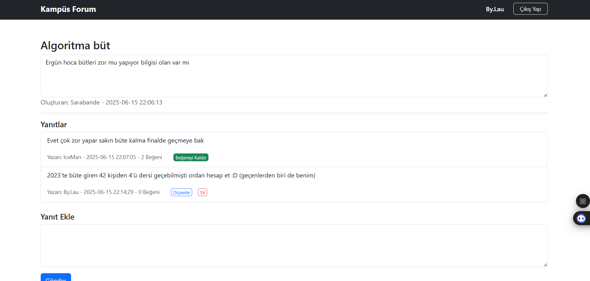

# Kampüs Forum

Kampüs Forum, üniversite öğrencileri için geliştirilmiş, PHP ve MySQL tabanlı bir tartışma platformudur. Bu proje, bir **öğrenci projesi** olarak backend tarafında herhangi bir framework kullanılmadan **yalın PHP** koduyla yazılmıştır. Kullanıcılar konu açabilir, yanıt yazabilir, yanıtları beğenebilir, kendi yanıtlarını düzenleyebilir veya silebilir. Proje, temel web geliştirme becerilerini sergilemek be geliştirmek amacıyla oluşturulmuştur. İlerleyen zamanda çok daha geniş bir veritabanı ve modern teknolojilerle gerçek bir platform haline getirilmesi hedeflenmektedir.

## Canlı Demo

Projeyi canlı olarak şu adreste test edebilirsiniz:\
http://95.130.171.20/\~st23360859007/index.html

## Özellikler

Kullanıcı olarak,

- **Kullanıcı Yönetimi**: Kayıt olabilir, giriş yapabilir ve çıkış yapabilirsiniz.

- **Konu İşlemleri**: Yeni konu açabilir ve mevcut konuları görüntüleyebilirsiniz.

- **Yanıt İşlemleri**: Konulara yanıt verebilir, kendi yanıtlarınızı düzenleyebilir veya silebilirsiniz.

- **Beğeni Sistemi**: Diğer kullanıcıların yanıtlarını beğenebilir ve beğeni sayısı görebilirsiniz.

- **Profil Sayfası**: Açtığı konu, yazdığınız yanıt ve beğendiğiniz yanıtları görebilirsiniz.

- **Düzenleme Geçmişi**: Yanıtlarınızı düzenleyebilir ve yanıtlarınızın eski sürümlerini görebilirsiniz.

## Kullanılan Teknolojiler

- **Backend**: PHP
- **Database**: MySQL
- **Frontend**: HTML, CSS, Bootstrap 5
- **Sunucu**: XAMPP (yerel geliştirme)

## Güvenlik Önlemleri

Bu öğrenci projesi, temel güvenlik uygulamalarını içerir:

- **SQL Injection**: Tüm veritabanı sorguları `mysqli` ile hazırlanmış ifadeler (`prepare`) ve parametre bağlama (`bind_param`) kullanılarak korunur. Örneğin:

  ```php
  $stmt = $baglanti->prepare("SELECT * FROM kullanicilar WHERE id = ?");
  $stmt->bind_param("i", $kullanici_id);
  ```

- **XSS Koruması**: Kullanıcı girdileri (konu başlığı, yanıt içeriği, vb.) `htmlspecialchars` ile işlenir:

  ```php
  <?= htmlspecialchars($kullanici['kullanici_adi']) ?>
  ```

- **Yetki Kontrolleri**: Kullanıcılar sadece kendi yanıtlarını düzenleyebilir/silebilir.

- **Oturum Güvenliği**: Oturum yönetimi `session_start()` ve `$_SESSION` ile yapılır, giriş yapmamış kullanıcılar korunmuş sayfalara erişemez.

## Ekran Görüntüleri

Aşağıda projenin farklı sayfalarından ekran görüntüleri yer alıyor. 

- **Ana Sayfa**:

  

- **Giriş Sayfası**:

  

- **Kayıt Sayfası**:

  

- **Konu**:

  

- **Yanıt Düzenleme**:

  

## Tanıtım Videosu

Projenin nasıl çalıştığını gösteren bir video:

## Veritabanı Yapısı

Örnek tablo yapısı:

```sql
CREATE TABLE kullanicilar (
    id INT AUTO_INCREMENT PRIMARY KEY,
    kullanici_adi VARCHAR(50) NOT NULL UNIQUE,
    email VARCHAR(100) NOT NULL UNIQUE,
    sifre VARCHAR(255) NOT NULL
);

CREATE TABLE konular (
    id INT AUTO_INCREMENT PRIMARY KEY,
    baslik VARCHAR(255) NOT NULL,
    icerik TEXT NOT NULL,
    kullanici_id INT NOT NULL,
    tarih DATETIME NOT NULL,
    FOREIGN KEY (kullanici_id) REFERENCES kullanicilar(id)
);

CREATE TABLE yanitlar (
    id INT AUTO_INCREMENT PRIMARY KEY,
    konu_id INT NOT NULL,
    kullanici_id INT NOT NULL,
    icerik TEXT NOT NULL,
    tarih DATETIME NOT NULL,
    begeni_sayisi INT NOT NULL DEFAULT 0,
    FOREIGN KEY (konu_id) REFERENCES konular(id),
    FOREIGN KEY (kullanici_id) REFERENCES kullanicilar(id)
);

CREATE TABLE begeniler (
    id INT AUTO_INCREMENT PRIMARY KEY,
    yanit_id INT NOT NULL,
    kullanici_id INT NOT NULL,
    FOREIGN KEY (yanit_id) REFERENCES yanitlar(id),
    FOREIGN KEY (kullanici_id) REFERENCES kullanicilar(id),
    UNIQUE (yanit_id, kullanici_id)
);

CREATE TABLE yanit_gecmisi (
    id INT AUTO_INCREMENT PRIMARY KEY,
    yanit_id INT NOT NULL,
    eski_icerik TEXT NOT NULL,
    duzenleme_tarihi DATETIME NOT NULL,
    FOREIGN KEY (yanit_id) REFERENCES yanitlar(id)
);
```

## İletişim

yusufemre7009@gmail.com
Ayrıca sorularınız için GitHub Issues üzerinden iletişime geçebilirsiniz.
